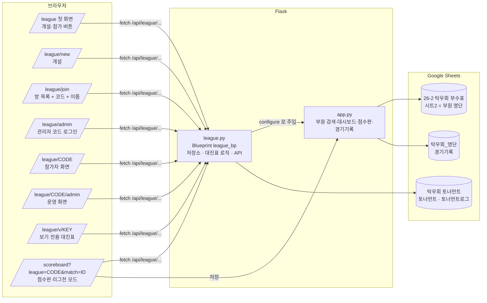
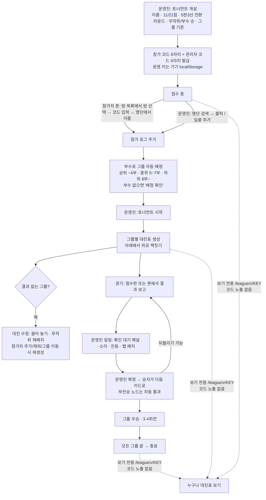

# 리그전(토너먼트) 기능 인수인계 문서

기준: 2026-09-30, 브랜치 `feature/league` 최신 커밋 `f0a7cff` (main보다 18커밋 앞, **아직 main에 머지하지 않음**).
다른 세션·다른 사람이 이 문서만 읽고 이어서 작업할 수 있도록 지금까지의 논의와 구조를 정리했다.

## 0. 한눈에 보기

| 항목 | 값 |
| --- | --- |
| 실서비스 | https://powerdrive-hanyang.vercel.app (main 푸시 시 자동 배포, 리그전은 아직 없음) |
| 프리뷰 | https://powerdrive-hanyang-git-feature-league-alsh02.vercel.app (feature/league 푸시 시 자동) |
| 기술 | Flask 3 + Jinja + Tailwind Play CDN + lucide 1.44, Google Sheets(gspread 6.2), Vercel 서버리스 |
| 리그전 데이터 파일 | 구글 시트 **`탁우회 토너먼트`** (시트 `토너먼트`, `토너먼트로그` 자동 생성) |
| 사용자가 아직 해야 할 일 | 드라이브에 `탁우회 토너먼트` 시트를 만들고 서비스 계정(`탁우회_명단` 공유 목록의 …@…iam.gserviceaccount.com)에 **편집자**로 공유. 전까지는 개설·목록이 503 안내를 낸다 |
| 다음 단계 | 프리뷰에서 실사용 점검 → 문제 없으면 `feature/league`를 main에 머지 |

## 1. 시스템 구조도



같은 내용을 글로 쓰면:

```
브라우저(폰·PC)  ──/league/*──▶  Flask app.py ──▶ league.py(league_bp)
                                     │                    │
                                     │ 부원 명단(SHEET_ID) │ 토너먼트 상태·로그
                                     ▼                    ▼
                       '26-2 탁우회 부수표' 시트2      '탁우회 토너먼트'
                       '탁우회_명단' 경기기록  ◀── 점수판 저장 / 리그전 확정 결과
```

* `app.py`가 시트 연결·부원 명단·경기기록을 갖고, `league.configure(**deps)`로 `league.py`에 필요한 함수만 넘긴다(순환 import 방지).
* 서버리스라 인스턴스마다 메모리 캐시가 따로 있다. 시트 읽기 쿼터(분당 60회)를 넘지 않도록 요청당 읽기 1회(3초 캐시)·쓰기 1회로 설계했다.

## 2. 리그전 흐름도



역할별 권한:

| 역할 | 식별 | 할 수 있는 것 |
| --- | --- | --- |
| 운영진 | `X-League-Key` 헤더(운영 키, 개설 시 발급 또는 관리자 코드로 재획득) | 참가자 추가·제외·그룹 이동, 시작, 대진 수정, 5판 전환·3·4위전 설정, 결과 확정·되돌리기, 삭제 |
| 참가자 | 참가 시 받은 토큰(localStorage `league_token_CODE`) | 내 경기 결과 보고, 점수판 자동 보고 |
| 보기 전용 | 없음 | 대진표·진행 상황 보기만 |

## 3. 파일 지도

| 파일 | 역할 |
| --- | --- |
| `league.py` | 블루프린트 전체: 시트 저장소, 상태 조립, 대진표 알고리즘, 라우트(페이지·API), 오류 처리 |
| `app.py` | 시트 연결(`open_spreadsheet`, `open_records_spreadsheet`, `open_league_spreadsheet`), 부원 명단, 경기기록, 점수판, 맨 아래 `league.configure(...)` + `register_blueprint` |
| `templates/league/home.html` | 개설/참가 버튼, 관리자 코드로 열기, 마지막 방 이어보기 |
| `templates/league/new.html` | 개설 폼(점수·5판 전환·배치·그룹 기준), 개설 중 안내 상자 |
| `templates/league/join.html` | 열린 방 목록(접수 중 = 코드 입력 버튼, 진행/종료 = 대진표 보기 링크), 코드·이름 입력, 참가 중 안내 상자 |
| `templates/league/admin.html` | 참가 코드 + 관리자 코드로 운영 화면 열기 |
| `templates/league/room.html` | 참가자·운영진·보기 전용이 함께 쓰는 방 화면(접수 카드, 참가자 추가, 대진표 트리, 끌어 놓기, 결과 패널, 알림, 폴링) |
| `templates/scoreboard.html` | `?league=CODE&match=ID`면 선수·판수 고정, 왼쪽 위 버튼 '대진표로', 저장 시 리그전 결과 보고 |
| `templates/base.html` | 상단 메뉴 4개(부원 검색·대시보드·점수판·리그전), `.select-chevron`, 푸터 인스타 |
| `public/static/hangul-search.js` | 초성 검색(`window.HangulSearch.matchName`) — 검색·점수판·리그전 공용 |
| `README.md` | 기능 설명 7번 항목, 환경변수 |

## 4. 데이터 저장 구조

* 시트 `토너먼트` 열: `코드, 상태, 생성일시, 갱신일시, 상태JSON, 관리자코드`. 방 하나 = 한 행. 운영진 동작만 이 행을 덮어쓴다.
* 시트 `토너먼트로그` 열: `코드, 종류, 시각, 내용JSON`. 참가·결과 보고는 **추가만** 한다(여러 폰이 동시에 써도 충돌 없음). 상태를 읽을 때 로그를 합쳐 `assemble()`로 조립한다.
* 상태JSON 주요 키: `code, name, status(lobby|running|finished), format{target,best_of,best_of_from}, seed(random|division), groups[{key,name,min,max}], group_overrides, removed[], brackets{group: bracket}, admin_key, admin_code, created_at, updated_at, finished_at`.
  화면에는 `public_view()`로 `admin_key, admin_code, _tokens, _row_no`를 뺀 것만, 보기 전용에는 `code`까지 뺀 것만 보낸다.
* 참가자는 로그의 `참가` 항목으로 만들고(`added_by_admin`, 토큰), 같은 이름이 본인 폰으로 참가하면 토큰이 연결된다.
* 보기 전용 키 = `sha256("view:" + admin_key)[:12]`. 저장 없이 항상 같고, 키로는 코드를 알 수 없다.
* 상수: `CACHE_TTL=3`, `WRITE_LIMIT=240/10분`, `ADMIN_LOGIN_LIMIT=30/10분`, `ROOM_LIST_LIMIT=30`, `FINISHED_ROOM_DAYS=2`(종료 이틀 뒤 목록에서 제외).

## 5. 대진표 모델과 알고리즘

사용자가 준 그림(10명: 5경기 → 2경기+부전승 → 1경기+부전승 → 결승)에 맞춘 **아래에서 위로 짝짓기** 방식이다. 2의 제곱으로 채우는 표준 대진표는 쓰지 않는다.

1. 1라운드는 모두 짝을 짓는다. 홀수면 한 명만 부전승(오른쪽 끝). 부수 순 배치면 최상위가 부전승.
2. 다음 라운드는 이웃끼리 짝을 짓고, 홀수가 남으면 끝 노드 하나가 **부전승 노드**(`bye: true`, 카드 없음)로 올라간다. 부전승 자리는 홀수 라운드마다 오른쪽·왼쪽을 번갈아 같은 사람이 연속으로 쉬지 않게 한다.
3. `bracket.entrants[r]`(라운드 인원)로 라벨(10강 → 5강 → 준결승 → 결승)과 5판 3선 전환(`entrants <= best_of_from`)을 정한다.
4. 부수 순 배치: 1-끝, 2-끝-1 … 짝을 만들고 상위 짝끼리는 멀리(`seed_order`). 무작위는 섞어서 이웃끼리.

경기 dict: `{id: "group-round-index", round, index, players[2], winner, games, status(waiting|pending|bye|confirmed), best_of, next, slot, bye?, report?}`. 3·4위전은 `bracket.third`(id `group-3rd`).

핵심 함수(`league.py`):

| 함수 | 역할 |
| --- | --- |
| `build_bracket` | 위 알고리즘으로 생성 후 `reflow_bracket` |
| `reflow_bracket` | 1라운드 배치만 보고 부전승·상위 라운드·`third_possible` 재계산(결과 없을 때만) |
| `_advance` / `_retract` | 승자 올리기(부전승 노드는 연쇄 통과) / 되돌리기(연쇄로 비움) |
| `third_feeders` / `sync_third` | 결승 두 자리로 이어지는 길의 마지막 실제 경기 → 그 패자끼리 3·4위전. 한쪽에 실제 경기가 없으면(3명·5명) 3·4위전 불가 |
| `move_player` / `swap_slots` | 1라운드 자리 옮기기(빈 자리면 이동, 사람 있으면 교환) / 두 선수 교환 |
| `rebuild_group` | 참가자 변경·재배치 시 그룹 대진표 새로 생성 |
| `confirm_match` / `reset_match` / `validate_games` | 결과 확정·되돌리기·게임 점수 검증(점수는 항상 `players[0]:players[1]` 순서) |
| `_editable_groups` | 확정 결과가 하나라도 있는 그룹은 대진 수정 거절 |

화면(`room.html`)의 `renderTree`: 경기마다 아래 달린 선수 수(leaves)만큼 세로 공간(pitch 58px), 카드 176px + 연결선 32px, SVG 연결선은 부전승 노드를 건너뛰어 다음 보이는 카드까지. 수정 모드(`[data-edit]`)에서는 1라운드의 빈 자리까지 모두 보이고 `[data-drag]` → `[data-slot]` 끌어 놓기(마우스 즉시, 터치는 350ms 꾹 누른 뒤, 스크롤 의도면 취소) → `POST /brackets/<g>/move`.

## 6. API 목록

| 메서드·경로 | 권한 | 설명 |
| --- | --- | --- |
| `GET /api/league` | 공개 | 방 목록(이름·상태·인원·그룹, 진행/종료 방은 `view` 키). 코드는 절대 안 줌 |
| `POST /api/league` | 공개 | 개설 → `code, admin_key, admin_code` |
| `GET /api/league/<code>` | 공개 | 방 상태(public_view) |
| `GET /api/league/v/<view>` | 공개 | 보기 전용 상태(코드 없음) |
| `POST .../admin-login {admin_code}` | 공개(제한) | 관리자 코드 → 운영 키 |
| `POST .../join {name, room}` | 공개 | 참가(접수 중만, 명단 이름만, 방 이름 검증) → 토큰 |
| `POST .../participants {name, group|remove}` | 운영 | 그룹 이동·제외 |
| `POST .../participants/add {names[]}` | 운영 | 명단에서 사전 등록(최대 100명/요청) |
| `POST .../settings {best_of_from}` | 운영 | 5판 3선 전환 라운드 변경 |
| `POST .../third-place {group, enabled}` | 운영 | 3·4위전 켜기/끄기 |
| `POST .../brackets/<g>/rebuild {seed}` | 운영 | 그룹 대진 새로 생성(random|division) |
| `POST .../brackets/<g>/move {name, match, slot}` | 운영 | 끌어 놓기 |
| `POST .../brackets/<g>/swap {a, b}` | 운영 | 두 선수 교환(구 API, 유지) |
| `POST .../start` | 운영 | 접수 마감 + 대진표 생성 |
| `POST .../matches/<id>/report {winner, games?, token|admin_key}` | 참가자/운영 | 결과 보고(점수판·폰) |
| `POST .../matches/<id>/confirm {winner?, games?}` | 운영 | 확정(본문 없으면 보고대로). 게임 점수가 있으면 `경기기록`에도 저장 |
| `POST .../matches/<id>/reset` | 운영 | 되돌리기 |
| `POST .../delete` | 운영 | 방 삭제(화면 버튼은 아직 없음) |

오류: `LeagueError` → 지정 상태 코드 + `{error}`; 시트 없음 → 503 "'탁우회 토너먼트' 구글 시트를 찾을 수 없습니다…"; gspread APIError → 503.

## 7. 결정 사항 로그 (사용자 요구 → 반영)

1. 첫 화면은 개설·참가 버튼 두 개. 참가 코드·관리자 코드 모두 **숫자 6자리**.
2. 경기 방식은 **3판 2선으로 시작해 정한 라운드부터 5판 3선**(개설 화면엔 이 전환 메뉴만, 진행 중 변경 가능). 3판/5판 선택 항목은 없앴다.
3. 운영진 식별은 **별도 관리자 코드**. 모든 운영진 기기를 닫아 코드를 잃어도 시트 `토너먼트` F열에서 찾을 수 있고, 참가 화면의 방 목록으로 방을 찾을 수 있다.
4. **3·4위전**은 그룹별로 진행 중 켜고 끔. 단판 토너먼트.
5. 강은석·구동영은 리그전에서 1부. 시트2 `비고` 열에 "0부", 이름에서 "(0)" 제거.
6. 반영 속도·실패 문제 → 시트 호출을 요청당 1~2회로 줄임, 실패 시 조용히 재시도, 503 안내.
7. 참가·개설 버튼에 "리그전 참가 중입니다"/"토너먼트 개설 중입니다" 안내 상자(회전 아이콘).
8. 참가 화면에 **열린 방 목록**(게임 파티처럼), 코드는 입장 암호. 방 페이지 제목은 대회 이름.
9. 참가자가 결과를 보내면 **운영진 알림**(확인 대기 패널·토스트·진동·소리·탭 배지).
10. 운영진이 명단에서 **미리 참가자 등록**, 대진표 생성·수정. 본인이 나중에 참가하면 자리 연결.
11. 리그전 데이터는 **별도 시트 `탁우회 토너먼트`**.
12. 점수판 리그전 모드의 왼쪽 위 버튼은 '메인으로' 대신 **'대진표로'**.
13. 접수 카드에서 이름이 "한.."으로 잘리던 버그 → 상태 안내를 둘째 줄로, 이름은 안 줄임.
14. 참가자 추가 칸은 **그룹 카드 아래**(진행 중엔 대진표 아래) — 검색 목록이 카드를 가리지 않게.
15. 추가 목록에서 누른 줄은 **회전 → 체크**로 바뀌고 목록에 남는다(이미 참가한 사람도 체크로 표시).
16. "부수 시드"는 시트 값이 아니라 배치 방식 → 문구를 **'부수 순 배치'**로. 진행 중 '부수 순 재배치' 버튼은 **제거**(무작위 재배치·개설 시 부수 순 배치는 유지).
17. 대진표는 **왼쪽 1라운드 → 오른쪽 결승 트리**, 부전승은 카드 없이 다음 라운드에. 카드 조작은 머리의 아이콘(점수판·결과 입력·보고대로 확정·되돌리기).
18. 대진 수정은 **끌어 놓기**(폰은 꾹 누른 뒤).
19. 대진 방식은 사용자 이미지대로 **아래에서 위로 짝짓기**(모두 1라운드 경기). 3·4위전 규칙도 이에 맞춤.
20. 참가자 추가에 **일괄 추가 버튼**(검색 결과 전체 / 명단 전체, 인원 확인 후).
21. '대진표 보기'는 **보기 전용 주소**로 열어 참가 코드가 드러나지 않게.

디자인 원칙(사용자 취향): 세로 막대·그라데이션·뱃지 같은 "AI틱한" 요소 대신 타이포·정렬로 위계, 중복 링크 금지, 사이트 톤(흰 카드·회색 선·빨강 강조, 다크 모드 `rubber`) 유지.

## 8. 테스트 방법

테스트 도구는 저장소 밖 `~/.cache/claude-powerdrive-tests/`에 있다(세션이 바뀌어도 남는다. 없으면 아래처럼 다시 만든다).

```bash
cd ~/.cache/claude-powerdrive-tests
./venv/bin/python fake_server.py &            # 가짜 구글 시트 + 앱, 포트 5002 (템플릿을 고치면 재시작)
./venv/bin/python league-api-test.py          # API 흐름 94건
node league-ui-test.js                        # 브라우저(퍼펫티어, 시스템 크롬) 54건: 운영진 2대 + 폰 4~5대
node check.js                                 # 기존 기능 회귀 29건 (새 서버에서 먼저 돌릴 것)
node tree-shot.js / touch-drag.js / bulk-add.js / viewer-shot.js   # 개별 화면 캡처·확인, 결과는 shots/
```

다시 만들 때: `/Users/alsh02/miniconda3/bin/python3 -m venv venv && ./venv/bin/pip install flask gspread google-auth`, `npm i puppeteer-core`. `fake_server.py`는 `sys.path`에 저장소 경로를 넣고 `app`을 import한 뒤 gspread를 가짜 클라이언트(부원 30명·경기기록·토너먼트 시트, 호출 수 카운터 `/__fake/calls`)로 바꾼다. 시스템 python3.14의 venv는 pip이 깨져 있으니 miniconda 파이썬을 쓴다.

## 9. 주의사항

* 실서비스 점수판에서 **저장 버튼을 누르지 않는다**(실제 `경기기록` 오염).
* 부수표 **시트1(그림형)은 편집하지 않는다**. 시트2만 표 데이터.
* Vercel 봇 검문(403 Security Checkpoint)은 우회하지 않는다.
* iOS 사파리: `<select>` padding 무시(`.select-chevron`으로 해결), 전체화면에서 입력 시 경고(점수판은 입력 전 전체화면 해제), 프로그램으로 focus해도 키보드 안 뜸.
* 폴링은 6초(+지터), 종료 20초, 화면 가려지면 운영진만 15초. 끌어 놓는 동안엔 다시 그리지 않는다.

## 10. 남은 일 · 아이디어

* [ ] 사용자: `탁우회 토너먼트` 시트 생성·공유 → 프리뷰에서 실제 시트로 개설~종료 한 번 점검.
* [ ] 실제 아이폰·아이패드에서 꾹 누른 뒤 끌기 확인(에뮬레이터로만 검증함).
* [ ] `feature/league` → main 머지(머지 전 README 확인).
* [ ] 아이디어(요청 없음): 화면에서 방 삭제 버튼(API는 있음), 명단에 없는 손님 참가, 동시 진행 대회 여러 개, 끌어 놓기의 키보드 대안, 종료된 대회 결과 보관·조회.
