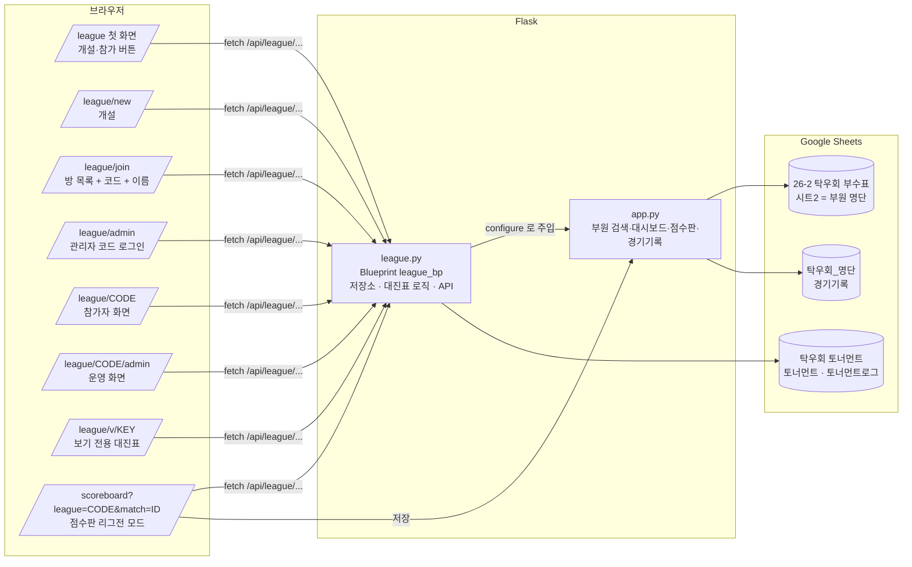
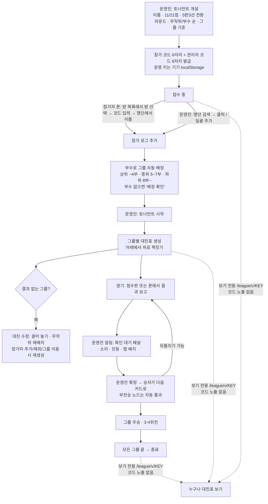

# 리그전(토너먼트) 기능 인수인계 문서

기준: 2026-09-30, 브랜치 `feature/league` (**아직 main에 머지하지 않음**). 마지막 갱신: 동시 저장 보호(운영 기록 로그) · 대진표 밖 참가자 알림 · 끌기 자동 스크롤.
다른 세션·다른 사람이 이 문서만 읽고 이어서 작업할 수 있도록 지금까지의 논의와 구조를 정리했다.

## 0. 한눈에 보기

| 항목 | 값 |
| --- | --- |
| 실서비스 | https://powerdrive-hanyang.vercel.app (main 푸시 시 자동 배포, 리그전은 아직 없음) |
| 프리뷰 | https://powerdrive-hanyang-git-feature-league-alsh02.vercel.app (feature/league 푸시 시 자동) |
| 기술 | Flask 3 + Jinja + Tailwind Play CDN + lucide 1.44, Google Sheets(gspread 6.2), Vercel 서버리스 |
| 리그전 데이터 파일 | 구글 시트 **`탁우회 토너먼트`** (시트 `토너먼트`, `토너먼트로그` 자동 생성) |
| 리그전 시트 | `탁우회 토너먼트` 생성·공유 완료 (프리뷰에 테스트 방 '테스트1'·'테스트2'가 있음) |
| 다음 단계 | 프리뷰에서 실사용 점검 → 문제 없으면 `feature/league`를 main에 머지 |

## 1. 시스템 구조도



같은 내용을 글로 쓰면:

```
브라우저(폰·PC)  ──/league/*──▶  Flask app.py ──▶ league.py(league_bp)
                                     │                    │
                                     │ 부원 명단(SHEET_ID) │ 토너먼트 상태·로그
                                     ▼                    ▼
                       '26-2 탁우회 부수표' 시트2      '탁우회 토너먼트'
                       '탁우회_명단' 경기기록  ◀── 점수판 저장 / 리그전 확정 결과
```

* `app.py`가 시트 연결·부원 명단·경기기록을 갖고, `league.configure(**deps)`로 `league.py`에 필요한 함수만 넘긴다(순환 import 방지).
* 서버리스라 인스턴스마다 메모리 캐시가 따로 있다. 시트 읽기 쿼터(분당 60회)를 넘지 않도록 요청당 읽기 1회(3초 캐시)·쓰기 1회로 설계했다.
* 여러 요청이 동시에 와도 변경이 사라지지 않게, 모든 변경은 `토너먼트로그`에 한 줄로 **덧붙인다**(4·5절). 방 행은 그 결과를 저장해 둔 스냅숏이다.

## 2. 리그전 흐름도



역할별 권한:

| 역할 | 식별 | 할 수 있는 것 |
| --- | --- | --- |
| 운영진 | `X-League-Key` 헤더(운영 키, 개설 시 발급 또는 관리자 코드로 재획득) | 참가자 추가·제외·그룹 이동, 시작, 대진 수정, 5판 전환·3·4위전 설정, 결과 확정·되돌리기, 삭제 |
| 참가자 | 참가 시 받은 토큰(localStorage `league_token_CODE`) | 내 경기 결과 보고, 점수판 자동 보고 |
| 보기 전용 | 없음 | 대진표·진행 상황 보기만 |

## 3. 파일 지도

| 파일 | 역할 |
| --- | --- |
| `league.py` | 블루프린트 전체: 시트 저장소, 상태 조립, 대진표 알고리즘, 라우트(페이지·API), 오류 처리 |
| `app.py` | 시트 연결(`open_spreadsheet`, `open_records_spreadsheet`, `open_league_spreadsheet`), 부원 명단, 경기기록, 점수판, 맨 아래 `league.configure(...)` + `register_blueprint` |
| `templates/league/home.html` | 개설/참가 버튼, 관리자 코드로 열기, 마지막 방 이어보기 |
| `templates/league/new.html` | 개설 폼(점수·5판 전환·배치·그룹 기준), 개설 중 안내 상자 |
| `templates/league/join.html` | 열린 방 목록(접수 중 = 코드 입력 버튼, 진행/종료 = 대진표 보기 링크), 코드·이름 입력, 참가 중 안내 상자 |
| `templates/league/admin.html` | 참가 코드 + 관리자 코드로 운영 화면 열기 |
| `templates/league/room.html` | 참가자·운영진·보기 전용이 함께 쓰는 방 화면(접수 카드, 참가자 추가, 대진표 트리, 끌어 놓기, 결과 패널, 알림, 폴링) |
| `templates/scoreboard.html` | `?league=CODE&match=ID`면 선수·판수 고정, 왼쪽 위 버튼 '대진표로', 저장 시 리그전 결과 보고 |
| `templates/base.html` | 상단 메뉴 4개(부원 검색·대시보드·점수판·리그전), `.select-chevron`, 푸터 인스타 |
| `public/static/hangul-search.js` | 초성 검색(`window.HangulSearch.matchName`) — 검색·점수판·리그전 공용 |
| `README.md` | 기능 설명 7번 항목, 환경변수 |

## 4. 데이터 저장 구조

* 시트 `토너먼트로그` 열: `코드, 종류, 시각, 내용JSON`. **원본**. 덧붙이기만 한다(여러 폰·여러 운영진이 동시에 써도 서로 덮어쓰지 않음). 종류:
  * `참가` `{name, division, token, by?}` — 본인 참가(토큰) 또는 운영진 등록(`by: 운영진`, 토큰 없음)
  * `보고` `{match, players, winner, games, by}` — 선수 결과 보고. `players`(그때의 대진)가 지금 대진과 다르면 그 보고는 숨는다
  * `운영` `{id, op, …}` — 운영진 동작 하나. `op`: `start, settings, third, rebuild, move, swap, confirm(players 포함), reset, group, remove, add`
* 시트 `토너먼트` 열: `코드, 상태, 생성일시, 갱신일시, 상태JSON, 관리자코드`. 방 하나 = 한 행. 운영 기록을 적용한 **스냅숏**이고, 적용한 운영 기록 id를 `applied`에 모아 둔다.
  방을 지워도 행은 남기고 내용만 비운다(`상태=삭제`) — 행이 밀리면 다른 방의 저장이 엉뚱한 행을 덮기 때문.
* **동시 저장 보호**(2026-09-30): 운영진 요청은 `load_state(force)` → `apply_op`로 지금 상태에 적용해 보고(안 되면 400, 아무것도 안 씀) → `commit_op`가 운영 기록을 로그에 덧붙이고(**이 순간 확정**) 스냅숏 행을 고친다. 스냅숏 저장이 실패해도 요청은 성공으로 끝난다(기록이 로그에 있으므로).
  읽기와 로그 덧붙이기는 구글이 잠깐 거절하면(429·5xx) 1~2초 뒤 한 번 다시 한다(`_retrying`). 같은 줄이 두 번 들어가도 운영 기록은 id로, 참가는 이름으로 한 번만 세고 보고는 경기별 마지막 것만 쓰므로 괜찮다(방 개설은 두 번 들어가면 방이 둘이 되므로 다시 하지 않는다).
  덧붙이기는 반드시 `values.append` + `insertDataOption: INSERT_ROWS`로 한다 — 동시에 와도 건마다 새 행이 끼워진다(프리뷰에서 참가 16건 동시 확인). batchUpdate의 `appendCells`는 동시에 오면 같은 행에 써서 한쪽이 **사라진다**(프리뷰에서 8건 동시에 보내 2~5건 유실 확인) — 쓰지 말 것.
  두 운영진이 거의 동시에 저장하면 나중 스냅숏이 앞 스냅숏을 덮지만, 읽을 때 `assemble()`이 스냅숏의 `applied`에 없는 운영 기록을 로그 순서대로 다시 적용해 되살린다(지금 상태와 맞지 않는 기록 — 같은 경기를 둘이 확정 등 — 은 건너뜀).
  무작위 배치는 운영 기록 id를 씨앗으로 써서(`random.Random(id)`) 어느 인스턴스에서 다시 적용해도 같은 대진이 나오고, 동시에 추가된 참가자는 되살릴 때 함께 들어간다.
  이 보호가 생기기 전에는 '테스트1'에서 진행 중 동시 추가 24명 중 18명이 대진표에서 빠졌다(프리뷰 데이터로 확인, 가짜 서버에 지연을 넣어 재현).
* 상태JSON 주요 키: `code, name, status(lobby|running|finished), format{target,best_of,best_of_from}, seed(random|division), groups[{key,name,min,max}], group_overrides, removed[], brackets{group: bracket}, applied[], admin_key, admin_code, created_at, updated_at, finished_at`.
  화면에는 `public_view()`로 `admin_key, admin_code, applied`와 밑줄로 시작하는 내부 값(`_tokens, _joins, _reports, _row_no`)을 뺀 것만, 보기 전용에는 `code`까지 뺀 것만 보낸다.
  매번 계산해 붙이는 값: `participants`, 경기별 `report`, `unplaced`(그룹 대진표에 자리가 없는 참가자), `rev`(이 방의 로그 줄 수 — 화면은 지금보다 작은 `rev`의 응답을 버린다).
* 참가자는 로그의 `참가` 항목으로 만들고(`added_by_admin`, 토큰), 같은 이름이 본인 폰으로 참가하면 토큰이 연결된다.
* 보기 전용 키 = `sha256("view:" + admin_key)[:12]`. 저장 없이 항상 같고, 키로는 코드를 알 수 없다.
* 상수: `CACHE_TTL=3`, `WRITE_LIMIT=240/10분`, `ADMIN_LOGIN_LIMIT=30/10분`, `ROOM_LIST_LIMIT=30`, `FINISHED_ROOM_DAYS=2`(종료 이틀 뒤 목록에서 제외).

## 5. 대진표 모델과 알고리즘

사용자가 준 그림(10명: 5경기 → 2경기+부전승 → 1경기+부전승 → 결승)에 맞춘 **아래에서 위로 짝짓기** 방식이다. 2의 제곱으로 채우는 표준 대진표는 쓰지 않는다.

1. 1라운드는 모두 짝을 짓는다. 홀수면 한 명만 부전승(오른쪽 끝). 부수 순 배치면 최상위가 부전승.
2. 다음 라운드는 이웃끼리 짝을 짓고, 홀수가 남으면 끝 노드 하나가 **부전승 노드**(`bye: true`, 카드 없음)로 올라간다. 부전승 자리는 홀수 라운드마다 오른쪽·왼쪽을 번갈아 같은 사람이 연속으로 쉬지 않게 한다.
3. `bracket.entrants[r]`(라운드 인원)로 라벨(10강 → 5강 → 준결승 → 결승)과 5판 3선 전환(`entrants <= best_of_from`)을 정한다.
4. 부수 순 배치: 1-끝, 2-끝-1 … 짝을 만들고 상위 짝끼리는 멀리(`seed_order`). 무작위는 섞어서 이웃끼리.

경기 dict: `{id: "group-round-index", round, index, players[2], winner, games, status(waiting|pending|bye|confirmed), best_of, next, slot, bye?, report?}`. 3·4위전은 `bracket.third`(id `group-3rd`).

핵심 함수(`league.py`):

| 함수 | 역할 |
| --- | --- |
| `build_bracket` | 위 알고리즘으로 생성 후 `reflow_bracket` |
| `reflow_bracket` | 1라운드 배치만 보고 부전승·상위 라운드·`third_possible` 재계산(결과 없을 때만) |
| `_advance` / `_retract` | 승자 올리기(부전승 노드는 연쇄 통과) / 되돌리기(연쇄로 비움) |
| `third_feeders` / `sync_third` | 결승 두 자리로 이어지는 길의 마지막 실제 경기 → 그 패자끼리 3·4위전. 한쪽에 실제 경기가 없으면(3명·5명) 3·4위전 불가 |
| `move_player` / `swap_slots` | 1라운드 자리 옮기기(빈 자리면 이동, 사람 있으면 교환) / 두 선수 교환 |
| `rebuild_group` | 참가자 변경·재배치 시 그룹 대진표 새로 생성 |
| `confirm_match` / `reset_match` / `validate_games` | 결과 확정·되돌리기·게임 점수 검증(점수는 항상 `players[0]:players[1]` 순서) |
| `_editable_groups` | 확정 결과가 하나라도 있는 그룹은 대진 수정 거절 |
| `new_op` / `apply_op` / `commit_op` / `_run` | 운영 기록 만들기 · 상태에 적용(요청 처리와 되살리기가 같은 함수) · 로그에 덧붙이고 스냅숏 고치기 · 라우트 공통 흐름 |
| `assemble` / `compute_participants` / `refresh_derived` / `unplaced_players` | 스냅숏+로그 조립(되살리기 포함) · 참가자 목록 · 보고·대진표 밖 참가자 계산 |

화면(`room.html`)의 `renderTree`: 경기마다 아래 달린 선수 수(leaves)만큼 세로 공간(pitch 58px), 카드 176px + 연결선 32px, SVG 연결선은 부전승 노드를 건너뛰어 다음 보이는 카드까지. 수정 모드(`[data-edit]`)에서는 1라운드의 빈 자리까지 모두 보이고 `[data-drag]` → `[data-slot]` 끌어 놓기(마우스 즉시, 터치는 350ms 꾹 누른 뒤, 스크롤 의도면 취소) → `POST /brackets/<g>/move`.
끄는 동안은 손가락 스크롤을 막으므로 화면 위·아래 72px 안으로 끌면 저절로 스크롤한다(가장자리에 가까울수록 빠름) — 폰에서 9명 이상이면 1라운드 칸이 화면보다 길다.

화면의 요청 처리: 변경 요청은 기기마다 한 번에 하나씩 차례로 보낸다(`serial`). 보내는 중에 온 자동 새로 고침과 `rev`가 더 작은 응답은 그리지 않는다(옮긴 이름이 잠깐 되돌아가 보이는 깜박임 방지).
대진표 밖 참가자(`unplaced`)가 있으면 운영 도구 위에 이름과 '대진표에 넣기'(그 그룹을 개설 때 배치 방식으로 다시 짜기)가 뜨고, 다른 그룹 것은 그룹별 인원만 알린다. 본인 폰에는 '대진표에 아직 내 자리가 없습니다'.

## 6. API 목록

| 메서드·경로 | 권한 | 설명 |
| --- | --- | --- |
| `GET /api/league` | 공개 | 방 목록(이름·상태·인원·그룹, 진행/종료 방은 `view` 키). 코드는 절대 안 줌 |
| `POST /api/league` | 공개 | 개설 → `code, admin_key, admin_code` |
| `GET /api/league/<code>` | 공개 | 방 상태(public_view) |
| `GET /api/league/v/<view>` | 공개 | 보기 전용 상태(코드 없음) |
| `POST .../admin-login {admin_code}` | 공개(제한) | 관리자 코드 → 운영 키 |
| `POST .../join {name, room}` | 공개 | 참가(접수 중만, 명단 이름만, 방 이름 검증) → 토큰 |
| `POST .../participants {name, group|remove}` | 운영 | 그룹 이동·제외 |
| `POST .../participants/add {names[]}` | 운영 | 명단에서 사전 등록(최대 100명/요청) |
| `POST .../settings {best_of_from}` | 운영 | 5판 3선 전환 라운드 변경 |
| `POST .../third-place {group, enabled}` | 운영 | 3·4위전 켜기/끄기 |
| `POST .../brackets/<g>/rebuild {seed}` | 운영 | 그룹 대진 새로 생성(random|division). 대진표가 없는 그룹도 됨(대진표 밖 참가자 넣기) |
| `POST .../brackets/<g>/move {name, match, slot}` | 운영 | 끌어 놓기 |
| `POST .../brackets/<g>/swap {a, b}` | 운영 | 두 선수 교환(구 API, 유지) |
| `POST .../start` | 운영 | 접수 마감 + 대진표 생성 |
| `POST .../matches/<id>/report {winner, games?, token|admin_key}` | 참가자/운영 | 결과 보고(점수판·폰) |
| `POST .../matches/<id>/confirm {winner?, games?}` | 운영 | 확정(본문 없으면 보고대로). 게임 점수가 있으면 `경기기록`에도 저장 |
| `POST .../matches/<id>/reset` | 운영 | 되돌리기 |
| `POST .../delete` | 운영 | 방 삭제(화면 버튼은 아직 없음) |

오류: `LeagueError` → 지정 상태 코드 + `{error}`; 시트 없음 → 503 "'탁우회 토너먼트' 구글 시트를 찾을 수 없습니다…"; gspread APIError → 503.
운영진 변경 API는 시트 호출 3회(읽기 1 + 운영 기록 덧붙이기 1 + 스냅숏 1), 참가·보고는 2회(읽기 1 + 덧붙이기 1), 새로 고침은 3초 캐시 밖에서 1회.

## 7. 결정 사항 로그 (사용자 요구 → 반영)

1. 첫 화면은 개설·참가 버튼 두 개. 참가 코드·관리자 코드 모두 **숫자 6자리**.
2. 경기 방식은 **3판 2선으로 시작해 정한 라운드부터 5판 3선**(개설 화면엔 이 전환 메뉴만, 진행 중 변경 가능). 3판/5판 선택 항목은 없앴다.
3. 운영진 식별은 **별도 관리자 코드**. 모든 운영진 기기를 닫아 코드를 잃어도 시트 `토너먼트` F열에서 찾을 수 있고, 참가 화면의 방 목록으로 방을 찾을 수 있다.
4. **3·4위전**은 그룹별로 진행 중 켜고 끔. 단판 토너먼트.
5. 강은석·구동영은 리그전에서 1부. 시트2 `비고` 열에 "0부", 이름에서 "(0)" 제거.
6. 반영 속도·실패 문제 → 시트 호출을 요청당 1~2회로 줄임, 실패 시 조용히 재시도, 503 안내.
7. 참가·개설 버튼에 "리그전 참가 중입니다"/"토너먼트 개설 중입니다" 안내 상자(회전 아이콘).
8. 참가 화면에 **열린 방 목록**(게임 파티처럼), 코드는 입장 암호. 방 페이지 제목은 대회 이름.
9. 참가자가 결과를 보내면 **운영진 알림**(확인 대기 패널·토스트·진동·소리·탭 배지).
10. 운영진이 명단에서 **미리 참가자 등록**, 대진표 생성·수정. 본인이 나중에 참가하면 자리 연결.
11. 리그전 데이터는 **별도 시트 `탁우회 토너먼트`**.
12. 점수판 리그전 모드의 왼쪽 위 버튼은 '메인으로' 대신 **'대진표로'**.
13. 접수 카드에서 이름이 "한.."으로 잘리던 버그 → 상태 안내를 둘째 줄로, 이름은 안 줄임.
14. 참가자 추가 칸은 **그룹 카드 아래**(진행 중엔 대진표 아래) — 검색 목록이 카드를 가리지 않게.
15. 추가 목록에서 누른 줄은 **회전 → 체크**로 바뀌고 목록에 남는다(이미 참가한 사람도 체크로 표시).
16. "부수 시드"는 시트 값이 아니라 배치 방식 → 문구를 **'부수 순 배치'**로. 진행 중 '부수 순 재배치' 버튼은 **제거**(무작위 재배치·개설 시 부수 순 배치는 유지).
17. 대진표는 **왼쪽 1라운드 → 오른쪽 결승 트리**, 부전승은 카드 없이 다음 라운드에. 카드 조작은 머리의 아이콘(점수판·결과 입력·보고대로 확정·되돌리기).
18. 대진 수정은 **끌어 놓기**(폰은 꾹 누른 뒤).
19. 대진 방식은 사용자 이미지대로 **아래에서 위로 짝짓기**(모두 1라운드 경기). 3·4위전 규칙도 이에 맞춤.
20. 참가자 추가에 **일괄 추가 버튼**(검색 결과 전체 / 명단 전체, 인원 확인 후).
21. '대진표 보기'는 **보기 전용 주소**로 열어 참가 코드가 드러나지 않게.
22. (버그 수정) 진행 중 동시 추가로 대진표에서 사람이 빠지던 문제 → 운영진 동작도 로그에 덧붙이고 읽을 때 되살림. 같은 기기의 요청은 차례로.
23. 대진표에 자리가 없는 참가자는 운영진에게 알리고 **'대진표에 넣기'**로 다시 짠다(예전 버전 데이터·시작 순간의 참가 대비).
24. 폰에서 끌기 중 화면 가장자리 **자동 스크롤**(화면 밖 자리에도 놓을 수 있게).

디자인 원칙(사용자 취향): 세로 막대·그라데이션·뱃지 같은 "AI틱한" 요소 대신 타이포·정렬로 위계, 중복 링크 금지, 사이트 톤(흰 카드·회색 선·빨강 강조, 다크 모드 `rubber`) 유지.

## 8. 테스트 방법

테스트 도구는 저장소 밖 `~/.cache/claude-powerdrive-tests/`에 있다(세션이 바뀌어도 남는다. 없으면 아래처럼 다시 만든다).

```bash
cd ~/.cache/claude-powerdrive-tests
./venv/bin/python fake_server.py &            # 가짜 구글 시트 + 앱, 포트 5002 (템플릿을 고치면 재시작)
FAKE_LATENCY=0.25 PORT=5003 ./venv/bin/python fake_server.py &   # 시트 호출마다 0.25초 늦게 답하는 서버 (동시성 시험용)
node check.js                                 # 기존 기능 회귀 29건 (새 서버에서 먼저 돌릴 것)
./venv/bin/python league-api-test.py          # API 흐름 94건
node league-ui-test.js                        # 브라우저(퍼펫티어, 시스템 크롬) 54건: 운영진 2대 + 폰 4~5대
./venv/bin/python league-calls-test.py        # 요청당 시트 호출 수(새로 고침 1 · 참가 2 · 운영진 변경 3 이하)
./venv/bin/python retry-test.py               # 시트가 잠깐 503일 때 한 번 다시 시도, 같은 줄이 두 번 들어가도 한 번만 적용 7건
BASE=http://127.0.0.1:5003 ./venv/bin/python league-race-test.py   # 동시 요청 16~17건(동시 추가·확정·이동·보고, 시작과 참가 경합)
node unplaced-ui.js                           # 대진표 밖 참가자 알림·넣기, 지연 서버에서 빠르게 연속 추가 7건
node legacy-ui.js                             # 프리뷰 '테스트1' 데이터(예전 대진표 + 18명 누락)를 넣고 화면에서 복구 4건
node tree-shot.js / touch-drag.js / bulk-add.js / viewer-shot.js   # 개별 화면 캡처·확인, 결과는 shots/ (touch-drag는 화면 밖 빈 자리로 자동 스크롤해 놓기)
```

다시 만들 때: `/Users/alsh02/miniconda3/bin/python3 -m venv venv && ./venv/bin/pip install flask gspread google-auth`, `npm i puppeteer-core`. `fake_server.py`는 `sys.path`에 저장소 경로를 넣고 `app`을 import한 뒤 gspread를 가짜 클라이언트(부원 30명·경기기록·토너먼트 시트, 실제처럼 동시에 오면 행을 덮는 batchUpdate appendCells, 호출 수 카운터 `/__fake/calls`, 시트 내용 보기 `/__fake/league`, 줄 직접 넣기 `POST /__fake/league/append`, 다음 호출 실패시키기 `POST /__fake/fail {method, status, when: before|after}`)로 바꾼다. 시스템 python3.14의 venv는 pip이 깨져 있으니 miniconda 파이썬을 쓴다.

## 9. 주의사항

* 실서비스 점수판에서 **저장 버튼을 누르지 않는다**(실제 `경기기록` 오염).
* 부수표 **시트1(그림형)은 편집하지 않는다**. 시트2만 표 데이터.
* Vercel 봇 검문(403 Security Checkpoint)은 우회하지 않는다.
* iOS 사파리: `<select>` padding 무시(`.select-chevron`으로 해결), 전체화면에서 입력 시 경고(점수판은 입력 전 전체화면 해제), 프로그램으로 focus해도 키보드 안 뜸.
* 폴링은 6초(+지터), 종료 20초, 화면 가려지면 운영진만 15초. 끌어 놓는 동안엔 다시 그리지 않는다.
* 로컬에는 구글 키가 없다. 실제 시트 동작(동시 쓰기 등)은 프리뷰에서 시험 방을 만들어 확인하고 지운다(지운 방은 '삭제' 행으로 남음). 확정 시험은 **게임 점수 없이** 승자만 — 점수가 있으면 실제 `경기기록`에 남는다.
* 가짜 서버는 지연을 주지 않으면(`FAKE_LATENCY` 없음) 동시성 문제가 재현되지 않는다. 시트 쓰기 방식을 바꾸면 지연 서버로 `league-race-test.py`를 돌리고, 프리뷰에서도 동시 요청으로 로그 줄 수(`rev`)가 요청 수만큼 느는지 본다.

## 10. 남은 일 · 아이디어

* [x] 사용자: `탁우회 토너먼트` 시트 생성·공유 (프리뷰에 테스트 방 2개).
* [ ] '테스트1' 운영 화면에서 그룹마다 '대진표에 넣기'로 빠진 18명 복구 (관리자 코드는 시트 `토너먼트` F열).
* [ ] 프리뷰에서 실제 시트로 개설~종료 한 번 점검.
* [ ] 실제 아이폰·아이패드에서 꾹 누른 뒤 끌기 확인(에뮬레이터로만 검증함).
* [ ] `feature/league` → main 머지(머지 전 README 확인).
* [ ] 아이디어(요청 없음): 화면에서 방 삭제 버튼(API는 있음), 명단에 없는 손님 참가, 동시 진행 대회 여러 개, 끌어 놓기의 키보드 대안, 종료된 대회 결과 보관·조회.
