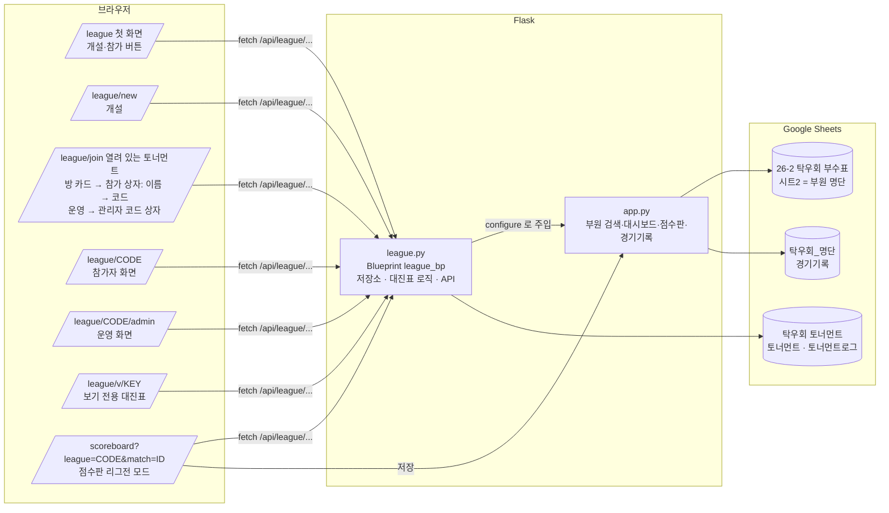

# 토너먼트(리그전) 기능 인수인계 문서

> 화면에 보이는 기능 이름은 **토너먼트**다(2026-09-30 사용자 결정 — '리그전'은 대회 이름으로 쓰인다). 이 문서·코드·주소(`/league`, `league.py`)의 '리그전'/league는 같은 기능을 가리킨다.

기준: 2026-10-01, **main에 머지함(실서비스 배포)** — 브랜치 `feature/league`를 그대로 fast-forward. 이후 작업은 main에서 새 브랜치를 딴다. 마지막 갱신: 운영 화면은 방 카드의 '운영'으로만(목록 아래 관리자 코드 링크 삭제) · 열려 있는 토너먼트(방 카드의 운영 · 관리자 코드 상자) · 참가 순서 이름 → 코드 · 조사 받침 맞춤 · 참가자 다시 연결(코드 + 이름) · 경기 카드 조작 줄(글자 버튼) · 기능 이름 '리그전' → '토너먼트' · 토스트 문구 온점 · 부전승 노드 뒤 되돌리기 버튼 · 자동 새로 고침 때 상태가 그대로면 다시 그리지 않음 · 서버 응답 대기 상자(모든 화면 공통) · 참가자 화면 맨 위 '내 정보' 카드 · 편성 중 단계 · 참가 QR · 관리자 코드만으로 운영 화면 열기.
다른 세션·다른 사람이 이 문서만 읽고 이어서 작업할 수 있도록 지금까지의 논의와 구조를 정리했다.

## 0. 한눈에 보기

| 항목 | 값 |
| --- | --- |
| 실서비스 | https://powerdrive-hanyang.vercel.app (main 푸시 시 자동 배포, 토너먼트는 `/league`) |
| 프리뷰 | 브랜치마다 `https://powerdrive-hanyang-git-<브랜치>-alsh02.vercel.app` (푸시 시 자동). 실서비스와 **같은 `탁우회 토너먼트` 시트**를 쓰므로 시험 방은 실서비스 목록에도 보인다 — 시험이 끝나면 바로 지운다 |
| 기술 | Flask 3 + Jinja + Tailwind Play CDN + lucide 1.44, Google Sheets(gspread 6.2), Vercel 서버리스 |
| 리그전 데이터 파일 | 구글 시트 **`탁우회 토너먼트`** (시트 `토너먼트`, `토너먼트로그` 자동 생성) |
| 리그전 시트 | `탁우회 토너먼트` 생성·공유 완료. 머지 전에 시험 방을 모두 정리함 |
| 다음 단계 | 실제 대회에서 써 보고 고칠 점 모으기, 실제 아이폰·아이패드에서 끌어 놓기 확인 |

## 1. 시스템 구조도



같은 내용을 글로 쓰면:

```
브라우저(폰·PC)  ──/league/*──▶  Flask app.py ──▶ league.py(league_bp)
                                     │                    │
                                     │ 부원 명단(SHEET_ID) │ 토너먼트 상태·로그
                                     ▼                    ▼
                       '26-2 탁우회 부수표' 시트2      '탁우회 토너먼트'
                       '탁우회_명단' 경기기록  ◀── 점수판 저장 / 리그전 확정 결과
```

* `app.py`가 시트 연결·부원 명단·경기기록을 갖고, `league.configure(**deps)`로 `league.py`에 필요한 함수만 넘긴다(순환 import 방지).
* 서버리스라 인스턴스마다 메모리 캐시가 따로 있다. 시트 읽기 쿼터(분당 60회)를 넘지 않도록 요청당 읽기 1회(3초 캐시)·쓰기 1회로 설계했다.
* 여러 요청이 동시에 와도 변경이 사라지지 않게, 모든 변경은 `토너먼트로그`에 한 줄로 **덧붙인다**(4·5절). 방 행은 그 결과를 저장해 둔 스냅숏이다.

## 2. 리그전 흐름도

```mermaid
flowchart TD
    C[운영진: 토너먼트 개설<br>이름 · 11/21점 · 5판3선 전환 라운드 · 무작위/부수 순 · 그룹 기준] --> K[참가 코드 6자리 + 관리자 코드 6자리 발급<br>운영 키는 기기 localStorage]
    K --> L[접수 중]
    L -->|참가자 폰: 참가 QR 찍기 또는 방 카드의 참가하기 → 상자에서 이름 → 참가 코드 → 입장| P[참가 로그 추가]
    L -->|운영진: 명단 검색 → 클릭 / 일괄 추가| P
    P --> G[부수로 그룹 자동 배정<br>상위 ~4부 · 중위 5~7부 · 하위 8부~<br>부수 없으면 '배정 확인']
    G --> DR[운영진: 대진표 만들기 → 편성 중<br>그룹별 대진표 생성 · 아래에서 위로 짝짓기<br>운영진만 보고, 참가 접수는 계속]
    DR --> ED[대진 수정: 끌어 놓기 · 무작위 재배치 · 3·4위전<br>참가자 카드로 그룹 이동·제외<br>새 참가자는 빈 자리(부전승 자리)나 맨 끝에 자동]
    ED --> ST[운영진: 토너먼트 시작<br>참가 접수 마감 · 선수 폰에 대진표]
    ST --> B[진행 중]
    B --> E{결과 없는 그룹?}
    E -->|예| RE[대진 수정 계속 가능<br>참가자 추가/제외 시 그 그룹 재생성]
    B --> PL[경기: 점수판 또는 폰에서 결과 보고]
    PL --> AL[운영진 알림: 확인 대기 패널 · 소리 · 진동 · 탭 배지]
    AL --> CF[운영진 확정 → 승자가 다음 카드로<br>부전승 노드는 자동 통과]
    CF -->|되돌리기 가능| PL
    CF --> W[그룹 우승 · 3·4위전]
    W --> F[모든 그룹 끝 → 종료]
    L & B & F -.->|보기 전용 /league/v/KEY<br>코드 노출 없음| VW[누구나 대진표 보기]
```

역할별 권한:

| 역할 | 식별 | 할 수 있는 것 |
| --- | --- | --- |
| 운영진 | `X-League-Key` 헤더(운영 키, 개설 시 발급 또는 관리자 코드로 재획득) | 참가자 추가·제외·그룹 이동, 시작, 대진 수정, 5판 전환·3·4위전 설정, 결과 확정·되돌리기, 삭제 |
| 참가자 | 참가 시 받은 토큰(localStorage `league_token_CODE`) | 내 경기 결과 보고, 점수판 자동 보고 |
| 보기 전용 | 없음 | 대진표·진행 상황 보기만 |

## 3. 파일 지도

| 파일 | 역할 |
| --- | --- |
| `league.py` | 블루프린트 전체: 시트 저장소, 상태 조립, 대진표 알고리즘, 라우트(페이지·API), 오류 처리 |
| `app.py` | 시트 연결(`open_spreadsheet`, `open_records_spreadsheet`, `open_league_spreadsheet`), 부원 명단, 경기기록, 점수판, 맨 아래 `league.configure(...)` + `register_blueprint` |
| `templates/league/home.html` | '토너먼트 개설' · '열려 있는 토너먼트' 버튼, 이 기기에서 마지막으로 연 방으로 돌아가기('김도윤으로 가을 리그전 돌아가기', 40 참고) |
| `templates/league/new.html` | 개설 폼(점수·5판 전환·배치·그룹 기준), 개설 중 안내 상자 |
| `templates/league/join.html` | 열린 방 카드마다 '대진표 보기'(보기 전용 주소) · '참가하기'. 참가하기 → 아래에서 올라오는 참가 상자: 1/2 이름 → 다음 → 2/2 참가 코드 → 입장(이전·취소·Esc·바깥 누르기). QR·'다시 연결' 링크로 오면 코드(와 이름)가 채워진 채 상자가 열린다. 진행 중인 방은 상자에 '이미 참가한 사람만 다시 연결' 안내 |
| `templates/league/room.html` | 참가자·운영진·보기 전용이 함께 쓰는 방 화면(맨 위 '내 정보' 카드, 접수 카드, 참가자 추가, 편성 중 시작 버튼, 대진표 트리, 끌어 놓기, 결과 패널, 알림, 참가 QR 패널, 폴링). QR은 cdnjs `qrcode-generator` 1.4.4(운영 화면에서만 defer로 불러옴) |
| `templates/scoreboard.html` | `?league=CODE&match=ID`면 선수·판수 고정, 왼쪽 위 버튼 '대진표로', 저장 시 리그전 결과 보고 |
| `templates/base.html` | 상단 메뉴 4개(부원 검색·대시보드·점수판·리그전), `.select-chevron`, 푸터 인스타, 서버 응답 대기 상자 `#busy` + `window.Busy.show(문구, {sub, delay})` (닫는 함수를 돌려줌) |
| `public/static/hangul-search.js` | 초성 검색(`window.HangulSearch.matchName`) — 검색·점수판·리그전 공용 |
| `README.md` | 기능 설명 7번 항목, 환경변수 |

## 4. 데이터 저장 구조

* 시트 `토너먼트로그` 열: `코드, 종류, 시각, 내용JSON`. **원본**. 덧붙이기만 한다(여러 폰·여러 운영진이 동시에 써도 서로 덮어쓰지 않음). 종류:
  * `참가` `{name, division, token, by?}` — 본인 참가(토큰) 또는 운영진 등록(`by: 운영진`, 토큰 없음)
  * `보고` `{match, players, winner, games, by}` — 선수 결과 보고. `players`(그때의 대진)가 지금 대진과 다르면 그 보고는 숨는다
  * `운영` `{id, op, …}` — 운영진 동작 하나. `op`: `start, settings, third, rebuild, move, swap, confirm(players 포함), reset, group, remove, add`
* 시트 `토너먼트` 열: `코드, 상태, 생성일시, 갱신일시, 상태JSON, 관리자코드`. 방 하나 = 한 행. 운영 기록을 적용한 **스냅숏**이고, 적용한 운영 기록 id를 `applied`에 모아 둔다.
  방을 지워도 행은 남기고 내용만 비운다(`상태=삭제`) — 행이 밀리면 다른 방의 저장이 엉뚱한 행을 덮기 때문.
* **동시 저장 보호**(2026-09-30): 운영진 요청은 `load_state(force)` → `apply_op`로 지금 상태에 적용해 보고(안 되면 400, 아무것도 안 씀) → `commit_op`가 운영 기록을 로그에 덧붙이고(**이 순간 확정**) 스냅숏 행을 고친다. 스냅숏 저장이 실패해도 요청은 성공으로 끝난다(기록이 로그에 있으므로).
  읽기와 로그 덧붙이기는 구글이 잠깐 거절하면(429·5xx) 1~2초 뒤 한 번 다시 한다(`_retrying`). 같은 줄이 두 번 들어가도 운영 기록은 id로, 참가는 이름으로 한 번만 세고 보고는 경기별 마지막 것만 쓰므로 괜찮다(방 개설은 두 번 들어가면 방이 둘이 되므로 다시 하지 않는다).
  덧붙이기는 반드시 `values.append` + `insertDataOption: INSERT_ROWS`로 한다 — 동시에 와도 건마다 새 행이 끼워진다(프리뷰에서 참가 16건 동시 확인). batchUpdate의 `appendCells`는 동시에 오면 같은 행에 써서 한쪽이 **사라진다**(프리뷰에서 8건 동시에 보내 2~5건 유실 확인) — 쓰지 말 것.
  두 운영진이 거의 동시에 저장하면 나중 스냅숏이 앞 스냅숏을 덮지만, 읽을 때 `assemble()`이 스냅숏의 `applied`에 없는 운영 기록을 로그 순서대로 다시 적용해 되살린다(지금 상태와 맞지 않는 기록 — 같은 경기를 둘이 확정 등 — 은 건너뜀).
  무작위 배치는 운영 기록 id를 씨앗으로 써서(`random.Random(id)`) 어느 인스턴스에서 다시 적용해도 같은 대진이 나오고, 동시에 추가된 참가자는 되살릴 때 함께 들어간다.
  이 보호가 생기기 전에는 '테스트1'에서 진행 중 동시 추가 24명 중 18명이 대진표에서 빠졌다(프리뷰 데이터로 확인, 가짜 서버에 지연을 넣어 재현).
* 상태: `lobby`(참가 접수 중) → `draft`(대진 편성 중, 참가 접수는 계속) → `running`(진행 중, 접수 마감) → `finished`(종료).
  편성 중에는 참가(로그에만 들어옴)가 올 때마다 읽는 쪽에서 `place_all`로 그룹 대진표의 첫 빈 자리(부전승 자리), 없으면 맨 끝에 넣는다 — 운영진이 옮긴 자리는 그대로(`place_players`, 1라운드 배치에서 `build_from_first`로 다시 쌓음).
  편성 중인 대진표는 운영 키가 있는 요청에만 보낸다(`public_view(admin=…)`, 참가자·보기 전용에는 `brackets: {}`).
* 상태JSON 주요 키: `code, name, status(lobby|draft|running|finished), format{target,best_of,best_of_from}, seed(random|division), groups[{key,name,min,max}], group_overrides, removed[], brackets{group: bracket}, applied[], admin_key, admin_code, created_at, updated_at, finished_at`.
  화면에는 `public_view()`로 `admin_key, admin_code, applied`와 밑줄로 시작하는 내부 값(`_tokens, _joins, _reports, _row_no`)을 뺀 것만, 보기 전용에는 `code`까지 뺀 것만 보낸다.
  매번 계산해 붙이는 값: `participants`, 경기별 `report`, `unplaced`(그룹 대진표에 자리가 없는 참가자), `rev`(이 방의 로그 줄 수 — 화면은 지금보다 작은 `rev`의 응답을 버린다).
* 참가자는 로그의 `참가` 항목으로 만들고(`added_by_admin`, 토큰), 같은 이름이 본인 폰으로 참가하면 토큰이 연결된다. `reconnect: true`인 `참가` 줄은 토큰을 바꾼다(다시 연결, `reconnected_at`). 참가자마다 토큰 지문 `tag`(sha256 앞 8자)를 공개해, 화면이 자기 토큰과 비교해 '이 기기의 연결이 끊겼습니다'를 띄운다.
* 보기 전용 키 = `sha256("view:" + admin_key)[:12]`. 저장 없이 항상 같고, 키로는 코드를 알 수 없다.
* 상수: `CACHE_TTL=3`, `WRITE_LIMIT=240/10분`, `ADMIN_LOGIN_LIMIT=30/10분`, `ROOM_LIST_LIMIT=30`, `FINISHED_ROOM_DAYS=2`(종료 이틀 뒤 목록에서 제외).

## 5. 대진표 모델과 알고리즘

사용자가 준 그림(10명: 5경기 → 2경기+부전승 → 1경기+부전승 → 결승)에 맞춘 **아래에서 위로 짝짓기** 방식이다. 2의 제곱으로 채우는 표준 대진표는 쓰지 않는다.

1. 1라운드는 모두 짝을 짓는다. 홀수면 한 명만 부전승(오른쪽 끝). 부수 순 배치면 최상위가 부전승.
2. 다음 라운드는 이웃끼리 짝을 짓고, 홀수가 남으면 끝 노드 하나가 **부전승 노드**(`bye: true`, 카드 없음)로 올라간다. 부전승 자리는 홀수 라운드마다 오른쪽·왼쪽을 번갈아 같은 사람이 연속으로 쉬지 않게 한다.
3. `bracket.entrants[r]`(라운드 인원)로 라벨(10강 → 5강 → 준결승 → 결승)과 5판 3선 전환(`entrants <= best_of_from`)을 정한다.
4. 부수 순 배치: 1-끝, 2-끝-1 … 짝을 만들고 상위 짝끼리는 멀리(`seed_order`). 무작위는 섞어서 이웃끼리.

경기 dict: `{id: "group-round-index", round, index, players[2], winner, games, status(waiting|pending|bye|confirmed), best_of, next, slot, bye?, report?}`. 3·4위전은 `bracket.third`(id `group-3rd`).

핵심 함수(`league.py`):

| 함수 | 역할 |
| --- | --- |
| `build_bracket` | 위 알고리즘으로 생성 후 `reflow_bracket` |
| `reflow_bracket` | 1라운드 배치만 보고 부전승·상위 라운드·`third_possible` 재계산(결과 없을 때만) |
| `_advance` / `_retract` | 승자 올리기(부전승 노드는 연쇄 통과) / 되돌리기(연쇄로 비움) |
| `third_feeders` / `sync_third` | 결승 두 자리로 이어지는 길의 마지막 실제 경기 → 그 패자끼리 3·4위전. 한쪽에 실제 경기가 없으면(3명·5명) 3·4위전 불가 |
| `move_player` / `swap_slots` | 1라운드 자리 옮기기(빈 자리면 이동, 사람 있으면 교환) / 두 선수 교환 |
| `rebuild_group` | 참가자 변경·재배치 시 그룹 대진표 새로 생성 |
| `confirm_match` / `reset_match` / `validate_games` | 결과 확정·되돌리기·게임 점수 검증(점수는 항상 `players[0]:players[1]` 순서) |
| `_editable_groups` | 확정 결과가 하나라도 있는 그룹은 대진 수정 거절 |
| `new_op` / `apply_op` / `commit_op` / `_run` | 운영 기록 만들기 · 상태에 적용(요청 처리와 되살리기가 같은 함수) · 로그에 덧붙이고 스냅숏 고치기 · 라우트 공통 흐름 |
| `assemble` / `compute_participants` / `refresh_derived` / `unplaced_players` | 스냅숏+로그 조립(되살리기 포함) · 참가자 목록 · 보고·대진표 밖 참가자 계산 |

화면(`room.html`)의 `renderTree`: 경기마다 아래 달린 선수 수(leaves)만큼 세로 공간(pitch 58px), 카드 176px + 연결선 32px, SVG 연결선은 부전승 노드를 건너뛰어 다음 보이는 카드까지. 수정 모드(`[data-edit]`)에서는 1라운드의 빈 자리까지 모두 보이고 `[data-drag]` → `[data-slot]` 끌어 놓기(마우스 즉시, 터치는 350ms 꾹 누른 뒤, 스크롤 의도면 취소) → `POST /brackets/<g>/move`.
끄는 동안은 손가락 스크롤을 막으므로 화면 위·아래 72px 안으로 끌면 저절로 스크롤한다(가장자리에 가까울수록 빠름) — 폰에서 9명 이상이면 1라운드 칸이 화면보다 길다.

화면의 요청 처리: 변경 요청은 기기마다 한 번에 하나씩 차례로 보낸다(`serial`). 보내는 중에 온 자동 새로 고침과 `rev`가 더 작은 응답은 그리지 않는다(옮긴 이름이 잠깐 되돌아가 보이는 깜박임 방지).
대진표 밖 참가자(`unplaced`)가 있으면 운영 도구 위에 이름과 '대진표에 넣기'(그 그룹을 개설 때 배치 방식으로 다시 짜기)가 뜨고, 다른 그룹 것은 그룹별 인원만 알린다. 본인 폰에는 '대진표에 아직 내 자리가 없습니다'.

## 6. API 목록

| 메서드·경로 | 권한 | 설명 |
| --- | --- | --- |
| `GET /api/league` | 공개 | 방 목록(이름·상태·인원·그룹, 모든 방에 `view` 키 — 접수 중이면 참가자 목록, 편성 중이면 대진표는 숨김). 코드는 절대 안 줌 |
| `POST /api/league` | 공개 | 개설 → `code, admin_key, admin_code` |
| `GET /api/league/<code>` | 공개 | 방 상태(public_view) |
| `GET /api/league/v/<view>` | 공개 | 보기 전용 상태(코드 없음) |
| `POST /api/league/admin-login {admin_code, view}` | 공개(제한) | 열려 있는 토너먼트의 방 카드 '운영'에서: 카드의 보기 키 `view`와 관리자 코드가 같은 방이면 → `code, name, admin_key, admin_url`. `view`가 없으면 400(관리자 코드만으로는 안 열림), 없는 관리자 코드 403, 다른 방의 관리자 코드면 400 '입력한 관리자 코드는 ○○ 토너먼트의 코드입니다' |
| `POST .../admin-login {admin_code}` | 공개(제한) | 방 화면에서(주소에 참가 코드) 관리자 코드 → 운영 키 |
| `POST .../join {name, room, reconnect?}` | 공개 | 참가 또는 다시 연결 → 토큰. 새 이름은 접수 중(lobby·draft)만. 이미 참가자인 이름은 시작 뒤에도 연결: 다른 기기에 연결돼 있으면 409 `can_reconnect` → `reconnect: true`로 다시 보내면 새 토큰(예전 토큰은 끊김), 운영진이 넣어 둔 이름(기기 없음)은 바로 연결. 제외된 이름은 거절 |
| `POST .../participants {name, group|remove}` | 운영 | 그룹 이동·제외 |
| `POST .../participants/add {names[]}` | 운영 | 명단에서 사전 등록(최대 100명/요청) |
| `POST .../settings {best_of_from}` | 운영 | 5판 3선 전환 라운드 변경 |
| `POST .../third-place {group, enabled}` | 운영 | 3·4위전 켜기/끄기 |
| `POST .../brackets/<g>/rebuild {seed}` | 운영 | 그룹 대진 새로 생성(random|division). 대진표가 없는 그룹도 됨(대진표 밖 참가자 넣기) |
| `POST .../brackets/<g>/move {name, match, slot}` | 운영 | 끌어 놓기 |
| `POST .../brackets/<g>/swap {a, b}` | 운영 | 두 선수 교환(구 API, 유지) |
| `POST .../draft` | 운영 | 접수 중 → 편성 중: 대진표 만들기(참가 접수는 계속) |
| `POST .../start` | 운영 | 편성 중 → 진행 중: 접수 마감, 고친 대진표 그대로 시작 (접수 중에서 부르면 대진표도 이때 만듦 — 화면에는 없음) |
| `POST .../matches/<id>/report {winner, games?, token|admin_key}` | 참가자/운영 | 결과 보고(점수판·폰) |
| `POST .../matches/<id>/confirm {winner?, games?}` | 운영 | 확정(본문 없으면 보고대로). 게임 점수가 있으면 `경기기록`에도 저장 |
| `POST .../matches/<id>/reset` | 운영 | 되돌리기 |
| `POST .../delete` | 운영 | 방 삭제(화면 버튼은 아직 없음) |

오류: `LeagueError` → 지정 상태 코드 + `{error}`; 시트 없음 → 503 "'탁우회 토너먼트' 구글 시트를 찾을 수 없습니다…"; gspread APIError → 503.
운영진 변경 API는 시트 호출 3회(읽기 1 + 운영 기록 덧붙이기 1 + 스냅숏 1), 참가·보고는 2회(읽기 1 + 덧붙이기 1), 새로 고침은 3초 캐시 밖에서 1회.

## 7. 결정 사항 로그 (사용자 요구 → 반영)

1. 첫 화면은 '토너먼트 개설' · '열려 있는 토너먼트' 버튼 두 개(39 참고). 참가 코드·관리자 코드 모두 **숫자 6자리**.
2. 경기 방식은 **3판 2선으로 시작해 정한 라운드부터 5판 3선**(개설 화면엔 이 전환 메뉴만, 진행 중 변경 가능). 3판/5판 선택 항목은 없앴다.
3. 운영진 식별은 **별도 관리자 코드**. 모든 운영진 기기를 닫아 코드를 잃어도 시트 `토너먼트` F열에서 찾을 수 있고, 참가 화면의 방 목록으로 방을 찾을 수 있다.
4. **3·4위전**은 그룹별로 진행 중 켜고 끔. 단판 토너먼트.
5. 강은석·구동영은 리그전에서 1부. 시트2 `비고` 열에 "0부", 이름에서 "(0)" 제거.
6. 반영 속도·실패 문제 → 시트 호출을 요청당 1~2회로 줄임, 실패 시 조용히 재시도, 503 안내.
7. 참가·개설 버튼에 "리그전 참가 중입니다"/"토너먼트 개설 중입니다" 안내 상자(회전 아이콘).
8. 참가 화면에 **열린 방 목록**(게임 파티처럼), 코드는 입장 암호. 방 페이지 제목은 대회 이름.
9. 참가자가 결과를 보내면 **운영진 알림**(확인 대기 패널·토스트·진동·소리·탭 배지).
10. 운영진이 명단에서 **미리 참가자 등록**, 대진표 생성·수정. 본인이 나중에 참가하면 자리 연결.
11. 리그전 데이터는 **별도 시트 `탁우회 토너먼트`**.
12. 점수판 리그전 모드의 왼쪽 위 버튼은 '메인으로' 대신 **'대진표로'**.
13. 접수 카드에서 이름이 "한.."으로 잘리던 버그 → 상태 안내를 둘째 줄로, 이름은 안 줄임.
14. 참가자 추가 칸은 **그룹 카드 아래**(진행 중엔 대진표 아래) — 검색 목록이 카드를 가리지 않게.
15. 추가 목록에서 누른 줄은 **회전 → 체크**로 바뀌고 목록에 남는다(이미 참가한 사람도 체크로 표시).
16. "부수 시드"는 시트 값이 아니라 배치 방식 → 문구를 **'부수 순 배치'**로. 진행 중 '부수 순 재배치' 버튼은 **제거**(무작위 재배치·개설 시 부수 순 배치는 유지).
17. 대진표는 **왼쪽 1라운드 → 오른쪽 결승 트리**, 부전승은 카드 없이 다음 라운드에. 카드 조작은 카드 아래 조작 줄(34번).
18. 대진 수정은 **끌어 놓기**(폰은 꾹 누른 뒤).
19. 대진 방식은 사용자 이미지대로 **아래에서 위로 짝짓기**(모두 1라운드 경기). 3·4위전 규칙도 이에 맞춤.
20. 참가자 추가에 **일괄 추가 버튼**(검색 결과 전체 / 명단 전체, 인원 확인 후).
21. '대진표 보기'는 **보기 전용 주소**로 열어 참가 코드가 드러나지 않게.
22. (버그 수정) 진행 중 동시 추가로 대진표에서 사람이 빠지던 문제 → 운영진 동작도 로그에 덧붙이고 읽을 때 되살림. 같은 기기의 요청은 차례로.
23. 대진표에 자리가 없는 참가자는 운영진에게 알리고 **'대진표에 넣기'**로 다시 짠다(예전 버전 데이터·시작 순간의 참가 대비).
24. 폰에서 끌기 중 화면 가장자리 **자동 스크롤**(화면 밖 자리에도 놓을 수 있게).
25. 시작 흐름 변경: 접수 화면의 **'대진표 만들기'** → 대진표 화면(편성 중)에서 고친 뒤 **'토너먼트 시작'**을 눌러야 참가 접수가 끝난다. 편성 중 새 참가자는 **빈 자리에 자동**(고친 자리 유지), 편성 중 대진표는 **참가자에게 숨김**(시작하면 보임). 편성 중 운영진 화면에는 대진표 아래 참가자 카드(그룹 이동·제외)와 추가 칸이 있고, 본인 폰으로 들어온 사람은 토스트로 알린다.
26. **참가 QR**: 운영 화면 '참가 QR 코드' → 큰 QR(참가 링크 `/league/join?code=…`) + 코드. 찍으면 코드가 채워진 참가 상자가 그 방 이름으로 열린다(37 참고).
27. **관리자 코드만으로 운영 화면 열기**(참가 코드 입력 없앰). 새 관리자 코드는 모든 방의 참가·관리자 코드와 겹치지 않게 발급, 예전 방끼리 겹치면 가장 최근 방.
28. 참가자 화면 맨 위(대회 이름 아래)에 **'내 정보' 카드** — 그룹 카드가 길어도 스크롤 없이 보이게. 접수·편성 중: 이름(크게)·부수·그룹·그룹 인원·다음 단계 안내(부수 없으면 그룹 확인 안내). 시작 뒤 같은 자리: 경기 가능(빨간 테두리 · 대진 순서 · 점수판/결과 보내기) · 다음 경기 대기 · '○○에서 탈락' · 우승/준우승/3위/4위(종료 뒤 라벨 '내 결과'). 참가 안 한 기기는 같은 자리에 '참가하기'(코드 채운 참가 화면), 운영진이 뺀 사람은 안내. 기존 '내 다음 경기' 카드와 접수 화면 아래 '…으로 참가했습니다' 문구는 이 카드로 합쳤다. 운영진 화면에는 없고, 운영진 기기가 참가자일 때 경기 차례에만 뜬다(`renderMe`, `myStanding`).
29. 서버 응답을 기다리는 곳에는 **전부 가운데 안내 상자**(참가 상자와 같은 모양, `base.html`의 공통 `Busy`): 참가·개설·운영 화면 열기(열려 있는 토너먼트의 운영 상자·방 화면의 코드 칸)·방 화면 처음 불러오기·대진표 만들기·시작·결과 보내기/확정·되돌리기·제외·재배치·대진표에 넣기·일괄 추가·점수판 리그전 경기 불러오기와 저장. 자주 하는 작은 동작(끌어 놓기·그룹 이동·3·4위전·5판 전환·보고대로 확정)은 응답이 0.25초보다 늦을 때만, 처음 불러오기는 0.2초보다 늦을 때만 띄워 번쩍임을 막는다. 몇 초마다 하는 자동 새로 고침과 명단에서 한 명씩 누르는 추가(누른 줄의 회전 표시가 대신함 — 연달아 누를 수 있게)는 상자를 띄우지 않는다. 페이지를 옮기는 경우(참가·개설·운영 화면 열기)는 다음 화면이 뜰 때까지 상자를 둔다.
30. 자동 새로 고침은 받은 상태가 지금 그려 둔 것과 **글자 하나까지 같으면 다시 그리지 않는다**(`accept`의 `shownJson` 비교). 몇 초마다 화면을 통째로 다시 그리면 누르는 순간 버튼이 새것으로 바뀌어 누름이 씹힐 수 있었다. 연결이 끊겼다 돌아오면 '연결 재시도 중' 표시를 지우려고 한 번은 다시 그리고, 끌어 놓는 중에 온 새로 고침은 받지 않고 다음 새로 고침에서 받는다.
31. 버튼을 누른 뒤 위에 뜨는 검은 토스트 문구는 **모두 온점으로 끝낸다**(방 화면·점수판). 명단에서 한 명 추가는 "김도윤 추가" 대신 다른 알림과 같은 문장으로 "김도윤을 추가했습니다." — 을/를은 이름 끝 글자 받침으로 고른다(`eulReul`). 서버 오류 문구는 원래 모두 온점으로 끝난다.
32. (버그 수정) 다음 칸이 부전승 노드인 경기(예: 5명 그룹 첫 경기)는 확정한 뒤 **되돌리기 버튼이 안 보였다** — 화면이 부전승 노드를 '끝난 경기'로 봤기 때문. 이제 서버 `reset_match`처럼 부전승 노드를 건너 실제 다음 경기가 끝났는지만 본다.
33. **기능 이름을 '리그전' → '토너먼트'**로: 상단 메뉴·메인 카드·첫 화면 제목·참가/불러오기 대기 문구·종료 요약·점수판 안내 띠와 결과 문구·경기기록 형식(`… · 토너먼트 {대회 이름}`)·README. '리그전'은 대회 이름이라 개설 화면 예시("26-2 탁우회 리그전")와 이름을 비웠을 때 기본 이름("탁우회 리그전 날짜")은 그대로. 주소·코드 이름(`/league`, `league`)도 그대로.
34. 운영진 경기 카드의 조작은 머리 줄 아이콘(24px 버튼을 24px 줄에 욱여넣어 판수가 잘리던 것) 대신 **카드 아래 조작 줄**에 글자 버튼으로: 점수판 · 입력 · 확정(보고가 있을 때) / 되돌리기. 칸을 카드 폭으로 나누고 주 동작만 빨간 글씨. 선수 보고 줄은 한 줄로(게임 점수는 title — 두 줄로 늘면 옆 카드와 겹쳤다). 운영진 화면은 트리 칸(pitch)을 58 → 80으로 넓혀 긴 카드끼리도 겹치지 않는다(참가자 화면은 그대로). 시안 두 개(글자 조작 줄 / 아이콘 축소)를 실제 화면에 그려 비교해 골랐다.
35. **참가 정보가 날아간 참가자는 참가 코드 + 이름으로 다시 연결**(앱 안 브라우저로 참가했다가 다른 브라우저로 열거나, 폰을 바꾸거나, 사이트 데이터가 지워진 경우). 시작 뒤에도 이미 참가자인 이름이면 된다. 다른 기기에 연결된 이름이면 '이 기기로 다시 연결할까요? 예전 기기는 연결이 끊깁니다' 확인을 받고(실수로 남의 이름을 고르지 않게), 예전 기기의 '내 정보' 카드에는 '이 기기의 참가 연결이 끊겼습니다' + '이 기기로 다시 연결'(이름이 채워진 참가 화면), 운영진에게는 'OOO이(가) 다른 기기로 다시 연결했습니다.' 알림. 참가 정보 없는 폰으로 진행 중인 방을 열면 작게 '참가자인데 이 기기에서 연결이 끊겼다면 다시 연결'. 사칭해도 결과 보고는 운영진 확정을 거치고 본인 폰에 끊김이 뜨므로 알아챌 수 있다.
36. 참가자 '내 정보' 카드의 **'점수판으로 경기'와 '결과 보내기'는 같은 크기**(높이 40px·글자 14px, 카드 폭을 반씩). 전에는 결과 보내기가 작은 공용 버튼(32px·12px)이라 작았다. 점수판만 빨간 채움, 결과 보내기는 테두리 버튼에 보내기 아이콘.
37. **참가 순서를 이름 → 참가 코드 → 입장**으로: 참가 화면의 방 카드마다 '대진표 보기' · '참가하기'(같은 크기, 카드 폭을 반씩). 참가하기를 누르면 참가 상자가 뜨고 1/2 이름(명단 검색) → 다음 → 2/2 참가 코드(숫자 6자리) → 입장. 이전으로 돌아가도 이름·코드는 남고, 다른 방의 참가하기를 누르면 이름은 두고 코드만 지운다(같은 사람이 방만 바꾼 것). 다른 방의 코드를 넣으면 서버가 '입력한 코드는 ○○ 방의 코드입니다'로 거른다(`room`). '대진표 보기'는 접수 중·편성 중 방에도 보기 전용 키를 준다 — 접수 중이면 참가자 목록, 편성 중이면 참가자 화면처럼 대진표를 숨긴다. 보기 키로는 코드를 알 수 없어 목록에서 코드가 드러나지 않는다. 방이 없으면 '참가 코드로 입장'으로 같은 상자를 연다.
38. 조사는 **앞 글자 받침으로 고른다**: 참가 상자 안내 '1부로 참가합니다' · '부수 미지정으로 참가합니다'(으로/로, ㄹ 받침은 '로'), 이름 뒤 은/는·이/가·을/를(다시 연결 확인창 '김도윤은 이미…', 혼자 남은 그룹 '홍길동이 시작하면 자동으로 우승합니다', 참가자 제외 확인창). 괄호로 둘 다 쓰던 '은(는)'·'이(가)'·'을(를)'은 이름을 아는 곳에선 쓰지 않는다. 서버 오류 문구 중 사용자가 친 값을 따옴표로 보여 주는 곳('…'은(는))은 영문·숫자일 수 있어 그대로 둔다.
39. 첫 화면의 '토너먼트 참가' 버튼을 **'열려 있는 토너먼트'**로 바꾸고, 운영 화면 들어가기를 그 화면의 **방 카드마다 '운영'**으로 옮겼다. 운영을 누르면 참가 상자처럼 **관리자 코드 상자**가 뜨고(6자리 숫자 → 운영 화면 열기), 그 카드의 보기 키를 함께 보내 다른 방의 관리자 코드면 그 방 이름으로 알려 준다. 운영은 운영진만 쓰므로 이름 줄 오른쪽에 작은 글자 버튼(열쇠 아이콘) — 참가자가 누르는 '대진표 보기' · '참가하기'와 겨루지 않게. 따로 있던 `/league/admin` 화면(`admin.html`)은 없앴다. 첫 화면의 '관리자 코드로 운영 화면 열기' 링크도 뺐다(같은 곳으로 가는 링크 두 개를 두지 않는다). 목록 아래 링크는 41에서 뺐다.
40. 첫 화면의 마지막 방 링크는 코드 대신 **'[참가자 이름]으로 [대회 이름] 돌아가기'**('김도윤으로 26-2 탁우회 가을 리그전 돌아가기', 받침 없으면 '정지호로'). 운영 화면이 마지막이면 '운영진으로 …', 참가하지 않고 방 화면만 열었으면 '[대회 이름] 돌아가기'. 모두 기기의 localStorage: `league_last` `{code, url, name(대회 이름)}` — 방 화면(참가자·운영진, 보기 전용 제외)을 열 때마다·참가·개설·운영 상자에서 저장 — 과 참가 이름은 그 방의 `league_token_<코드>`. 대회 이름 없이 저장된 예전 값은 한 번 서버에서 읽어 채우고, 그 방이 지워졌으면 링크를 띄우지 않는다. 긴 대회 이름만 말줄임하고 '돌아가기'는 늘 보인다. 개설·관리자 코드 로그인 응답에 `name`을 더했다.
41. 운영 화면은 **방 카드의 '운영'으로만** 연다(사용자 요구). 목록 아래 '목록에 없는 토너먼트는 관리자 코드로 운영 화면 열기' 링크와 코드만으로 여는 운영 상자를 없앴고, 서버도 보기 키(`view`) 없는 `POST /api/league/admin-login`을 400으로 거절한다. 예전 주소 `/league/admin`은 `/league/join`으로 보낸다(상자는 저절로 안 열림). 목록에서 빠진 방(끝난 지 이틀 지남·30개 초과)은 참가 코드를 아는 운영진이 `/league/<코드>/admin`의 관리자 코드 칸으로 연다.

디자인 원칙(사용자 취향): 세로 막대·그라데이션·뱃지 같은 "AI틱한" 요소 대신 타이포·정렬로 위계, 중복 링크 금지, 사이트 톤(흰 카드·회색 선·빨강 강조, 다크 모드 `rubber`) 유지.

## 8. 테스트 방법

테스트 도구는 저장소 밖 `~/.cache/claude-powerdrive-tests/`에 있다(세션이 바뀌어도 남는다. 없으면 아래처럼 다시 만든다).

```bash
cd ~/.cache/claude-powerdrive-tests
./venv/bin/python fake_server.py &            # 가짜 구글 시트 + 앱, 포트 5002 (템플릿을 고치면 재시작)
FAKE_LATENCY=0.25 PORT=5003 ./venv/bin/python fake_server.py &   # 시트 호출마다 0.25초 늦게 답하는 서버 (동시성 시험용)
node check.js                                 # 기존 기능 회귀 29건 (새 서버에서 먼저 돌릴 것)
# 스위트 여러 개를 이어 돌리면 서버의 쓰기 한도(10분 240회)가 쌓여 429가 난다 — 무거운 스위트마다 가짜 서버를 새로 띄운다
./venv/bin/python league-api-test.py          # API 흐름 95건
./run-suites.sh                               # 아래 스위트를 서버를 새로 띄워 가며 전부 돌리고 요약만 출력
node league-ui-test.js                        # 브라우저(퍼펫티어, 시스템 크롬) 64건: 운영진 2대 + 폰 4~5대 (접수 → 대진표 만들기 → 편성 중 → 시작 → 종료)
node resume-ui.js                             # 첫 화면 돌아가기: 이름으로/로 · 운영진으로 · 참가 안 한 기기 · 보기 전용은 안 바꿈 · 예전 값 채우기 · 지운 방 숨김 · 긴 이름 말줄임 12건
node join-flow-ui.js                          # 참가 화면: 방 카드 두 버튼 · 상자 1/2 이름 → 2/2 코드 · 이전/취소/Esc/바깥 · 방 바꾸면 코드 지움 · 다른 방 코드 · 진행 중 안내 · 보기 주소에 코드 없음 · 안내 조사(1부로/부수 미지정으로) · 카드의 운영 상자(숫자만·다른 방 코드·Esc/취소·방 바꾸면 코드 지움·운영 화면) · 목록 아래·빈 목록에 관리자 코드 링크 없음 34건
./venv/bin/python draft-api-test.py           # 편성 중 흐름·자동 배치·관리자 코드 로그인·편성 중 보기 키·카드의 운영(보기 키 없으면·다른 방 관리자 코드면 거절)·예전 /league/admin 주소·목록 아래 링크 없음 36건
node qr-admin-ui.js                           # 참가 QR(jsQR로 실제 판독) · QR로 열면 코드 채운 참가 상자 · 없는 코드 안내 · 예전 주소는 열려 있는 토너먼트로 · 카드의 운영으로 운영 화면 열기 10건
./venv/bin/python reconnect-test.py           # 다시 연결 API: 접수 중·시작 뒤 409→reconnect, 예전 토큰 403, 운영진 등록자 바로 연결, 제외된 이름 거절 13건
node reconnect-ui.js                          # 다시 연결 화면: 확인창·끊긴 폰 안내와 되찾기 링크·운영진 알림·참가 정보 없는 폰 안내 11건
node card-ui.js                               # 경기 카드: 운영진 조작 줄 글자·겹침 없음(3·4위전 포함)·보고 줄 한 줄·참가자 화면엔 조작 없음 9건
node card-shot.js <접두사>                     # 운영진 경기 카드 캡처(폰·PC, 밝은·어두운)
./venv/bin/python names-check.py              # 기능 이름: 메뉴·메인 카드·첫 화면은 '토너먼트', 대회 이름 예시만 '리그전' 5건
node toast-ui.js                              # 토스트 문구 모두 온점 · 을/를 · 부전승 노드 뒤 되돌리기 버튼 4건
node redraw-ui.js                             # 자동 새로 고침: 상태가 그대로면 다시 안 그림(버튼 유지) · 바뀌면 그림 · 연결 실패 뒤 표시 복구 8건
node busy-ui.js                               # 서버 응답 대기 상자: 요청을 브라우저에서 1.2초 늦춰 곳마다 문구 확인 · 자동 새로 고침엔 안 뜸 · 빠른 작은 동작엔 안 번쩍임 20건
node me-card-ui.js                            # '내 정보' 카드: 접수·배정 확인·미참가·편성·제외·경기 가능·대기·탈락·3·4위전·우승~4위·혼자 우승·운영진 화면 18건
node me-shot.js <접두사>                       # 참가자 폰 화면 단계별 캡처(shots/<접두사>-lobby·lobby-guest·draft·running·running-dark.png)
./venv/bin/python league-calls-test.py        # 요청당 시트 호출 수(새로 고침 1 · 참가 2 · 운영진 변경 3 이하)
./venv/bin/python retry-test.py               # 시트가 잠깐 503일 때 한 번 다시 시도, 같은 줄이 두 번 들어가도 한 번만 적용 7건
BASE=http://127.0.0.1:5003 ./venv/bin/python league-race-test.py   # 동시 요청 16~17건(동시 추가·확정·이동·보고, 시작과 참가 경합)
node unplaced-ui.js                           # 대진표 밖 참가자 알림·넣기, 지연 서버에서 빠르게 연속 추가 7건
node legacy-ui.js                             # 프리뷰 '테스트1' 데이터(예전 대진표 + 18명 누락)를 넣고 화면에서 복구 4건
node tree-shot.js / touch-drag.js / bulk-add.js / viewer-shot.js   # 개별 화면 캡처·확인, 결과는 shots/ (touch-drag는 화면 밖 빈 자리로 자동 스크롤해 놓기)
```

다시 만들 때: `/Users/alsh02/miniconda3/bin/python3 -m venv venv && ./venv/bin/pip install flask gspread google-auth`, `npm i puppeteer-core`. `fake_server.py`는 `sys.path`에 저장소 경로를 넣고 `app`을 import한 뒤 gspread를 가짜 클라이언트(부원 30명·경기기록·토너먼트 시트, 실제처럼 동시에 오면 행을 덮는 batchUpdate appendCells, 호출 수 카운터 `/__fake/calls`, 시트 내용 보기 `/__fake/league`, 줄 직접 넣기 `POST /__fake/league/append`, 다음 호출 실패시키기 `POST /__fake/fail {method, status, when: before|after}`)로 바꾼다. 시스템 python3.14의 venv는 pip이 깨져 있으니 miniconda 파이썬을 쓴다.

## 9. 주의사항

* 실서비스 점수판에서 **저장 버튼을 누르지 않는다**(실제 `경기기록` 오염).
* 부수표 **시트1(그림형)은 편집하지 않는다**. 시트2만 표 데이터.
* Vercel 봇 검문(403 Security Checkpoint)은 우회하지 않는다.
* iOS 사파리: `<select>` padding 무시(`.select-chevron`으로 해결), 전체화면에서 입력 시 경고(점수판은 입력 전 전체화면 해제), 프로그램으로 focus해도 키보드 안 뜸.
* 폴링은 6초(+지터), 종료 20초, 화면 가려지면 운영진만 15초. 받은 상태가 지금 화면과 같으면 다시 그리지 않고, 끌어 놓는 동안엔 새로 고침 응답을 받지 않는다.
* 로컬에는 구글 키가 없다. 실제 시트 동작(동시 쓰기 등)은 프리뷰에서 시험 방을 만들어 확인하고 지운다(지운 방은 '삭제' 행으로 남음). 확정 시험은 **게임 점수 없이** 승자만 — 점수가 있으면 실제 `경기기록`에 남는다.
* 가짜 서버는 지연을 주지 않으면(`FAKE_LATENCY` 없음) 동시성 문제가 재현되지 않는다. 시트 쓰기 방식을 바꾸면 지연 서버로 `league-race-test.py`를 돌리고, 프리뷰에서도 동시 요청으로 로그 줄 수(`rev`)가 요청 수만큼 느는지 본다.

## 10. 남은 일 · 아이디어

* [x] 사용자: `탁우회 토너먼트` 시트 생성·공유 (프리뷰에 테스트 방 2개).
* [x] 프리뷰 실제 시트 점검(2026-09-30): 개설·등록·시작·진행 중 동시 추가·동시 확정·되돌리기·삭제 12건 통과, 동시 확정·되돌리기 8건씩 두 차례 유실 없음.
* [x] main 머지 전 시험 방 정리(2026-10-01): 테스트1·2·3·'토너먼트 재접속 테스트'를 사용자가 시트에서 지움. 시트에서 직접 지울 때는 **행을 삭제하지 말고** B열을 `삭제`로, E열(상태JSON)·F열(관리자 코드)을 비우고 A열(코드)은 둔다 — 행을 지우면 아래 방들의 행 번호가 밀려 저장이 엉뚱한 행을 덮을 수 있고, 코드가 풀려 새 방이 같은 코드를 받으면 `토너먼트로그`의 옛 기록이 섞인다(`delete_tournament`와 같은 처리).
* [x] 프리뷰에서 실제 시트로 개설~종료 점검(2026-10-01): 5명 참가 → 대진표 만들기 → 시작 → 모든 경기 확정(게임 점수 없이) → 종료 → 삭제 9건 통과.
* [ ] 실제 아이폰·아이패드에서 꾹 누른 뒤 끌기 확인(에뮬레이터로만 검증함).
* [x] `feature/league` → main 머지(2026-10-01, fast-forward).
* [ ] 아이디어(요청 없음): 화면에서 방 삭제 버튼(API는 있음), 명단에 없는 손님 참가, 동시 진행 대회 여러 개, 끌어 놓기의 키보드 대안, 종료된 대회 결과 보관·조회.
